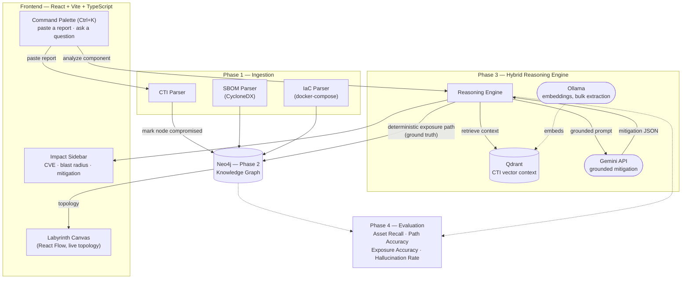

# Ariadne

**A deterministic GraphRAG engine that tells you, in minutes, whether a zero-day actually reaches you — and what to do about it right now.**

## The problem

When a critical CVE breaks, security teams are flooded with unstructured threat intel — vendor blogs, PDF advisories, social media threads — that someone has to manually cross-reference against the company's software inventory (SBOMs), network topology (Terraform, Kubernetes, Docker Compose), and internal playbooks. Knowing a CVE exists isn't the hard part. Answering *"does this affect us, can an attacker actually reach it from the internet, and what's the minimum fix that won't take production down"* in minutes, not hours, is.

The average time-to-exploit for a critical vulnerability has dropped from weeks to hours. The time a human spends reading a PDF, digging through a wiki for how a server is configured, and hand-writing a firewall rule is exactly the window where ransomware encrypts a database or data walks out the door. This is a SecOps / Vulnerability Management / DevSecOps problem, and it hits every organization running microservices complex enough that one compromised component can become a lateral-movement foothold.

## Why Parser + GraphRAG, not just an LLM

A raw LLM hallucinates IPs, invents dependencies, and has no idea what your private network actually looks like. A traditional search index doesn't understand that "this microservice talks to that one." Parser + GraphRAG is the one architecture that can do all three of the things this problem actually requires:

1. **Extract** clean structured facts (CVE, affected software, attack vector) out of noisy, unstructured CTI text.
2. **Model** the real internal environment — SBOMs and infrastructure configs mapped into an actual graph, not a vibe.
3. **Reason** about attack paths by grounding every LLM output strictly in the graph's real edges and the retrieved intel — never letting the model guess connectivity.

Commercial CNAPP tools (Wiz, Prisma Cloud, Orca) are excellent at signature-matching known CVEs against deployed containers. They're static databases that fire alerts. Ariadne is closer to a synthetic analyst: it can ingest a technical blog post about an attack *before* a CVE ID even exists, infer the attacker's method, trace the exact path through your real topology, and draft a mitigation in natural language — grounded, not guessed.

## How it works

Four layers, in the order a real incident actually moves through them:

1. **Ingestion & Parsing** (Phase 1) — a CTI parser extracts `CVE_ID`, `Target_Software`, `Affected_Versions`, and `Attack_Vector` from raw report text; SBOM and IaC parsers turn CycloneDX manifests and `docker-compose.yml` into graph nodes and edges.
2. **Knowledge Graph** (Phase 2) — the parsed topology lands in Neo4j: `Service` / `Library` / `Endpoint` nodes, `DEPENDS_ON` / `EXPOSES` / `COMMUNICATES_WITH` edges. This graph is the deterministic ground truth for every reachability question the system answers.
3. **Hybrid Reasoning Engine** (Phase 3) — given a vulnerable component, the engine retrieves CTI context from Qdrant and computes the exact exposure path from Neo4j (shortest path from any internet-facing node), then asks Gemini to synthesize a minimum-viable mitigation — strictly grounded in that subgraph. The LLM never decides what's connected to what; it only narrates what the graph already proved.
4. **Quantitative Evaluation** (Phase 4) — an automated pytest suite runs curated ground-truth scenarios end to end and asserts exact metrics: Asset Recall, Path Accuracy, Exposure Accuracy, Hallucination Rate. This is what lets the project claim "grounded," not just assume it.



## What makes this different

Static scanners tell you a CVE matches a version string. Ariadne answers the question that actually matters during an incident: *can an attacker reach it, and what's the smallest safe fix right now* — reasoning over a real graph of your infrastructure instead of a signature database, with every claim traceable back to an actual edge in Neo4j.

## Test results

Latest run (`pytest`, live Neo4j + Qdrant + Gemini, mock topology seeded via `scripts/seed_topology.py`):

```
tests/test_evaluation.py::test_load_ground_truth_parses_scenarios PASSED
tests/test_evaluation.py::test_evaluate_against_a_perfect_prediction PASSED
tests/test_metrics.py::test_asset_recall_penalizes_missed_assets PASSED
tests/test_metrics.py::test_exposure_accuracy_counts_correct_classifications PASSED
tests/test_metrics.py::test_path_accuracy_requires_exact_order PASSED
tests/test_metrics.py::test_hallucination_rate_flags_invented_assets PASSED
tests/test_parsers.py::test_parse_cti_report_extracts_log4shell_fields PASSED
tests/test_parsers.py::test_parse_docker_compose_flags_published_ports_as_internet_facing PASSED
tests/test_parsers.py::test_parse_cyclonedx_sbom_links_components_to_owning_service PASSED
tests/test_rag_pipeline.py::test_rag_pipeline_topological_accuracy[CVE-2021-44228] PASSED
tests/test_rag_pipeline.py::test_rag_pipeline_topological_accuracy[CVE-2022-22965] PASSED
tests/test_rag_pipeline.py::test_rag_pipeline_topological_accuracy[MISCONFIG-AUTH-DB-EXPOSED] SKIPPED

================ Ariadne Phase 4 -- GraphRAG Evaluation Summary ================
Scenario                      Asset Recall   Path Accuracy   Hallucination
--------------------------------------------------------------------------
CVE-2021-44228                        100%            100%              0%
CVE-2022-22965                        100%            100%              0%
MISCONFIG-AUTH-DB-EXPOSED             100%            100%              0%
--------------------------------------------------------------------------
CI gate: this suite must exit non-zero if any percentage above is not 100/100/0.

10 passed, 2 skipped
```

The three graph-derived metrics (Asset Recall, Path Accuracy, Hallucination Rate) come from Neo4j alone and assert unconditionally — they hold at 100/100/0 regardless of the LLM. The mitigation-keyword checks require a live Gemini call and are `skip`ped, not failed, when no key is configured or Gemini is transiently rate-limited/unavailable (the misconfiguration scenario has no CVE by design, so it always skips that check — see [`CONTRIBUTING.md`](./CONTRIBUTING.md)). `ruff check` and `mypy --strict` pass clean on the backend; `tsc -b` and `oxlint` pass clean on the frontend.

## Structure

- `backend/` — the reasoning engine: CTI/SBOM/IaC parsers, the Neo4j-backed knowledge graph, the hybrid RAG reasoning engine, and the quantitative evaluation framework. Python 3.11+, FastAPI.
- `frontend/` — the Ariadne interface: a dark interactive graph canvas (React Flow) that visualizes the exposure path as a glowing thread, a context-sensitive impact sidebar, and a `Ctrl+K` command palette in place of a chat window. React + Vite + TypeScript.
- `docker-compose.yml` — local infrastructure: Neo4j, Qdrant, Ollama, and both services, all self-hosted so the whole thing is reproducible with one command.

See [`CLAUDE.md`](./CLAUDE.md) for the full architecture and design rules, and [`CONTRIBUTING.md`](./CONTRIBUTING.md) for how changes get made and verified in this repo.

## Quickstart

```bash
# 1. Infrastructure (Neo4j, Qdrant, Ollama)
docker compose up -d neo4j qdrant ollama

# 2. Backend
cd backend
python3 -m venv .venv && source .venv/bin/activate
pip install -e ".[dev]"
cp .env.example .env   # fill in GEMINI_API_KEY
python scripts/seed_topology.py   # populate the mock topology
uvicorn ariadne.api.main:app --reload

# 3. Frontend (separate shell)
cd frontend
npm install
cp .env.example .env
npm run dev
```

Then open the frontend dev server URL and press `Ctrl+K` to paste a threat report or query the graph.

## Testing

```bash
cd backend && make test              # fast unit tests, no infra
cd backend && make test-integration  # Phase 4 eval against live Neo4j + Gemini
cd frontend && npm run build         # type-checks + builds
```
